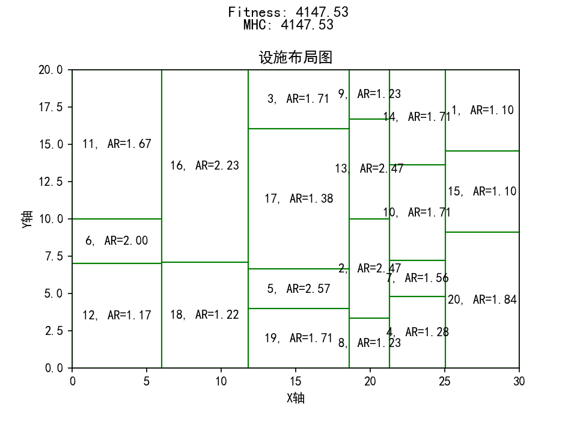
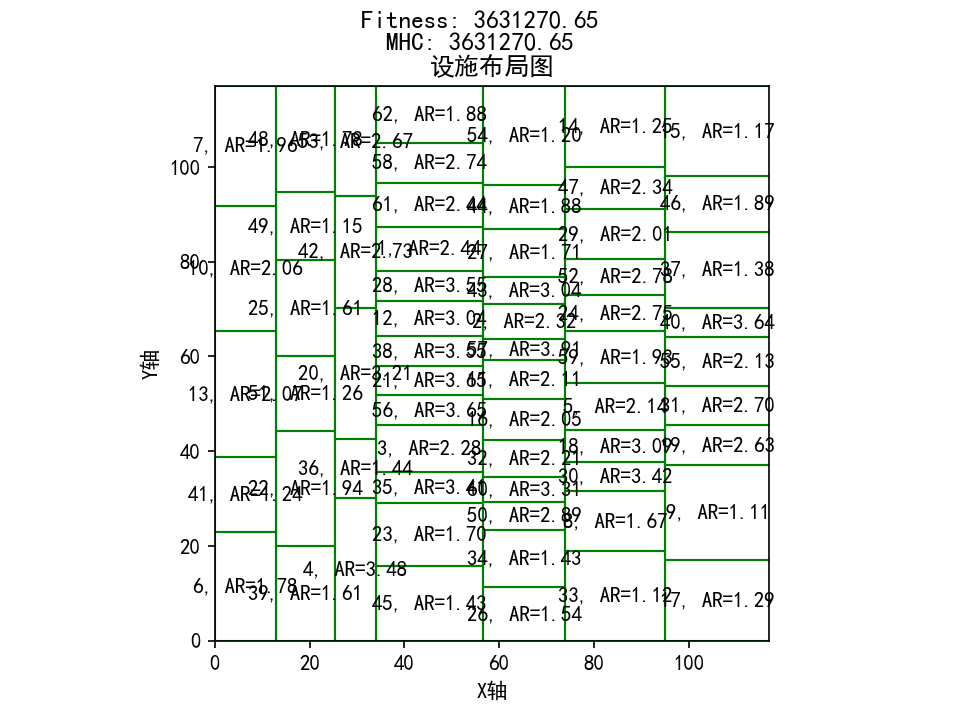
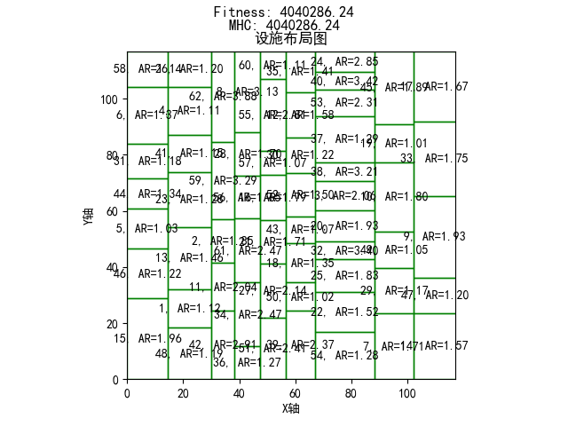

## 简介

<!-- UAFLP是什么 -->

不等积设施点布局问题 （UA-FLP） 是设施点布局问题 （FLP） 的一种类型，在一个平面区域中排列多个不重叠的矩形设施，在满足一定约束条件的情况下，得到一个最优的布局方案，即得到最小的物料搬运成本。

## 研究现状

## 强化学习的应用

应用 RL 有两种主要方法。一是重新设计强化学习的总体框架。该问题被转移为一个顺序决策过程，其中强化学习策略用于根据奖励和惩罚机制确定移动哪个邻居解决方案。这种方法不受人类经验的限制，可以自动发现解决问题的策略。模型训练完成后，可以标准化并解决类似问题。然而，许多强化学习方法本质上仍然是迭代解决方案，与传统方法相比，执行速度往往明显慢，并且解决方案的收敛性和质量难以保证强化学习本身的问题（Wang et al. 2022 ）。因此，鉴于各种优化技术已被证明是解决优化问题的有竞争力的工具，许多研究转向将强化学习作为优化器。主要有两个分支，一个是用作参数自适应方法（Yin et al. 2023 ；Liu et al. 2019 ），另一个是利用强化学习作为指导来调整迭代状态，以平衡探索和开发难题（赵等人， 2023 ；李等人， 2022 ）。这种集成机制可以根据各种更新策略动态调整搜索方向。在解决 UA-FLP 时，需要仔细考虑两个问题：设计一个与 UA-FLP 的特定独特属性相一致的有效操作池，以及开发一个动态调整迭代状态以平衡探索和利用的 RL 框架，指导 RL 代理的决策。

## DQN

## K 分初始解生成器

## 启发式算法

### 禁忌搜索

### 模拟退火

### 遗传算法

### 贪婪灰狼

###

## 实验结果

### 实验模型

#### AB20-ar3

参考文献：[Armour, G.C., Buffa, E.S.: A heuristic algorithm and simulation approach to relative location of facilities. Management Science 9(2), 294–309 (1963). DOI 10.1287/mnsc.9.2.294](https://sci-hub.se/10.1287/mnsc.9.2.294)

已知最佳 solution：

from：测试结果 TS-Convergence-Stage

```text
Best Solution: (array([12,  6, 11, 18, 16, 19,  5, 17,  3,  8,  2, 13,  9,  4,  7, 10, 14,
       20, 15,  1]), array([0., 0., 1., 0., 1., 0., 0., 0., 1., 0., 0., 0., 1., 0., 0., 0., 1.,
       0., 0., 1.]))
```



#### AEG20

参考文献：[Aiello, G., Enea, M., Galante, G.: An integrated approach to the facilities and material handling system design. International Journal of Production Research 40(15), 4007–4017 (2002). DOI 10.1080/00207540210159572](https://sci-hub.se/10.1080/00207540210159572)

#### SC30

#### SC35

#### Du62

参考文献：[https://www.tandfonline.com/doi/abs/10.1080/0020754031000118125](https://www.tandfonline.com/doi/abs/10.1080/0020754031000118125)

已知最佳 solution：
[Learning-based simulated annealing algorithm for unequal area facility layout problem](https://link.springer.com/article/10.1007/s00500-023-09372-6#Tab2)



```text
[6,41,13,10,7,39,22,51,25,49,48,4,36,20,42,53,45,23,35,3,56,21,38,12,28,1,61,58,62,26,34,50,60,32,16,11,57,2,43,27,44,54,33,8,30,18,5,59,24,52,29,47,14,17,9,19,31,55,40,37,46,15,]
[0,0,0,0,1,0,0,0,0,0,1,0,0,0,0,1,0,0,0,0,0,0,0,0,0,0,0,0,1,0,0,0,0,0,0,0,0,0,0,0,0,1,0,0,0,0,0,0,0,0,0,0,1,0,0,0,0,0,0,0,0,0,1,]
```

TS-Convergence-Stage 最佳 solution：


### TS

**TS-Convergence-Stage(TSCS)**
| 算法 | 实例 | 实验次数 | 迭代次数 | 禁忌表大小 | 初始解 | 步长 | 最差结果 | 平均结果 | 最佳结果 |平均耗时|
| -------- | --------- | -------- | -------- | ---------- | ------ | ---- | -------- | -------- | ---------- |-------|
| TSCS | O9-maoyan | 30 | 10000 | 100 | k 分法 | 1 | 1 | 0.98 | 254.387330 ||
|TSCS|AB20-ar3|30|10000|100|k 分法|1|14404.48604|9270.24756|4516.502062|2min|

**TS-Optimize-Stage**

**TS-Global**

### SA

**SA-Convergence-Stage**
| 算法 | 实例 | 实验次数 | 迭代次数 | 初始解 |初始温度|冷却系数|终止温度| 最差结果 | 平均结果 | 最佳结果 |平均耗时|
| -------- | --------- | -------- | -------- | ---------- | ------ | ---- | -------- | -------- | ---------- |-------|--------|
| SA-Convergence-Stage | AB20-ar3s | 30 | 12000 | k 分法 | 动态 | 0.999 | 0.01 | 9995.550233| 5640.883619| 4064.706157|2min|

**SA-Global**

## 参考文献
